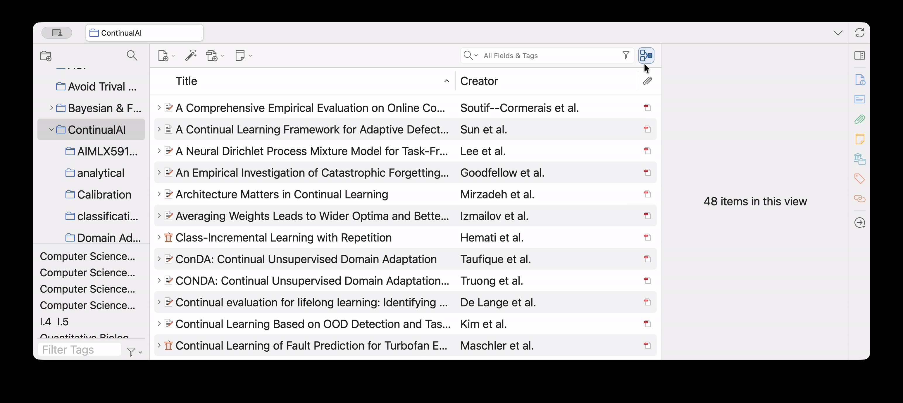

# CiteLoom

When you enter a research area, the papers you save in a Zotero collection are the ones you consider relevant. The next question is how those papers connect. Did one follow up an idea in another? Which papers belong together when you choose a baseline?

CiteLoom shows citation links within that collection. See how many of its papers cite each paper, expand a row to see which ones, or click a paper to highlight the others it cites. There is no graph to navigate or new visual language to learn. The relationships appear directly in your familiar Zotero list.

Google Scholar and other citation plugins help you explore the wider literature. CiteLoom is the simplest, most direct way to see how the papers you have chosen to study relate to one another.

A "Cited by" count shows how many papers in the selected collection cite that paper, rather than its total citations across the literature. Red arrows point from the selected paper to other papers in the collection that it cites. Hover over an arrow, then click it to jump to the cited paper.

## How CiteLoom finds citations

CiteLoom uses **attached PDFs** and make it simple. You do not need to configure a citation database or API key. It reads Zotero's extracted PDF text, looks in the references section, and matches references to papers in your library by DOI or normalized title. Your selected collection determines which of those links appear in the view.

This version depends on extractable PDF text and does not run OCR. A missing or unusual references heading, incomplete metadata, or ambiguous titles may lead to missed or incorrect matches.

## Next step
- **Manual correction**(planned): A small visual editor for adjusting PDF-derived citation relationships by dragging arrows between papers.

## Usage
Drag the compiled XPI file into Zotero's Add-ons Manager. Then open any collection and click the CiteLoom icon to see how its papers connect.

